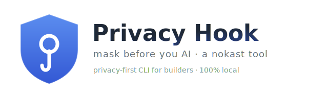

<p align="center">
  
</p>

<h1 align="center">🛡️ Privacy Hook</h1>

<p align="center">
  <b>A privacy-first CLI tool for builders.</b><br>
  Mask sensitive data <i>before</i> it ever reaches an AI tool — 100% local, no accounts, no network.
</p>

```
  ┌──────────────────────────────────────────────┐
  │   _  _     _         _     ___      _         │
  │  | \| |___| |_____ _| |_  | _ \_ _ (_)_ __    │
  │  | .` / _ \ / / _ (_-<  _| |  _/ '_|| \ V /   │
  │  |_|\_\___/_\_\___/__/\__| |_| |_|  |_|\_/    │
  │                                              │
  │        🛡️  Privacy Hook  ·  mask before you AI │
  └──────────────────────────────────────────────┘
```

---

## The problem

When you copy-paste into an AI (ChatGPT, Claude, Copilot, …), you often *accidentally*
include sensitive data: internal emails, API keys, client names, passwords. Once it's
sent to the cloud, you can't un-paste it.

## The Privacy Hook

`privacy-masker` is a tiny CLI that sits between your clipboard and the AI. It scans
text for sensitive patterns and swaps them for safe, labelled placeholders:

```
Before:  Email jane@corp.com, our key is sk-AbCd1234..., re: Project Titan
After:   Email [EMAIL], our key is [SECRET], re: [REDACTED]
```

**Privacy-first by design** — everything runs locally on your machine. No telemetry,
no accounts, no network calls. It's a hook you control, for the way builders actually
work: in the terminal and the clipboard.

---

## What it detects

**Pattern-based** (regex, zero dependencies, always on):

| Category | Examples |
| --- | --- |
| **Emails** | `jane.doe@corp.com` → `[EMAIL]` |
| **API keys & passwords** | OpenAI/Anthropic `sk-…`, AWS `AKIA…`, GitHub `ghp_…`, Slack, Stripe, Google, JWTs, PEM private keys, `password: …` / `api_key = …` assignments, `Bearer …` tokens |
| **Phone numbers** | `(555) 123-4567`, `+1 555-123-4567` → `[PHONE]` |
| **Social Security numbers** | `123-45-6789` → `[SSN]` |
| **Credit cards** | 13–19 digit numbers that pass the Luhn check → `[CARD]` |
| **IP addresses** | octet-validated IPv4, e.g. `192.168.1.50` → `[IP]` |
| **Custom keywords** | Your own list of client names / project codewords → `[REDACTED]` |

**Contextual PII** (spaCy NER, the optional `[ner]` extra) — catches data that has
*no fixed shape* and can't be matched by regex:

| Category | Examples | Default |
| --- | --- | --- |
| **Names** | `John Smith` → `[NAME]` | on |
| **Locations / addresses** | `San Francisco`, `Paris` → `[LOCATION]` | on |
| **Organisations** | `Acme Corp` → `[ORG]` | off* |
| **Dates** | `January 3rd`, `2021` → `[DATE]` | off* |

<sub>*ORG and DATE are off by default because redacting every company name or date
tends to over-redact ordinary prose. Enable them in the config when you need them.</sub>

Placeholders are **labelled** (`[EMAIL]`, not `XXX`) so the AI still understands the
shape of your text — it knows a name *was* there without ever seeing it. Every token,
category, and the keyword list is configurable. Everything runs **fully locally**,
including the NER model.

---

## Install

```bash
# Core engine + CLI (no third-party dependencies):
pip install -e .

# With clipboard support (for `mask --clipboard` and `watch`):
pip install -e '.[clipboard]'

# With contextual PII detection (names, locations, …):
pip install -e '.[ner]'
python -m spacy download en_core_web_sm   # one-time, ~12 MB, local

# With reversible lock/unlock for files (encrypted vault):
pip install -e '.[vault]'
```

Requires Python 3.9+. Without the extras everything still works — the
pattern-based categories run as normal and the optional features tell you how to
enable them.

---

## Usage

### 1. Mask a pipe / stdin

```bash
echo "ping jane@corp.com, pw: hunter2" | privacy-masker mask
# -> ping [EMAIL], pw: [SECRET]
```

### 2. Mask your clipboard in place

```bash
privacy-masker mask --clipboard
```

### 3. Watch mode — auto-mask as you copy 🪝

The hook you set and forget. Run it once; from then on, **anything you copy is scanned
and cleaned automatically** before you paste it anywhere. No hotkeys, no menu bar.

```bash
privacy-masker watch
# [14:02:51] redacted 1 email, 1 secret
# [14:03:10] redacted 2 keywords
```

`Ctrl+C` to stop. Tune the poll rate with `--interval 0.5`, or run silently with `--quiet`.

### 4. Manage your keyword redaction list

```bash
privacy-masker keywords add "Project Titan"
privacy-masker keywords list
privacy-masker keywords remove "Project Titan"
```

### 5. Inspect / create the config

```bash
privacy-masker config --init
```

### 6. Reversible masking for code files — `lock` / `unlock` 🔐

Unlike `mask` (one-way), `lock` **reversibly** masks secrets *in a file* and seals the
originals in an encrypted vault. Point a coding assistant (Cursor, Claude Code, …) at
the locked file and it sees only tokens — restore the real values with your passphrase
when you need to run the code.

```bash
privacy-masker lock app.py        # 192.168.1.50 -> PMV_00000001, sealed in .privacy-vault
#   (prompts for a passphrase the first time; cached in the OS keychain after)
# ... share / commit / let an assistant read app.py — the real values are gone ...
privacy-masker unlock app.py      # restores the originals (needs the passphrase)
privacy-masker vault-status       # show the vault location and how many values are sealed
```

How it works: each secret becomes a unique token (`PMV_…`), and the original is encrypted
with **Fernet** (AES) under a key stretched from your passphrase via **scrypt**. The vault
file holds *only* ciphertext.

> **Heads up — a locked file won't *run*** (the real values aren't in it). `lock` is a
> toggle for sharing/committing; `unlock` to execute. Add `.privacy-vault` to your
> `.gitignore`.
>
> **Threat model:** this stops secrets leaking to a *cloud AI*. It is **not** protection
> against a local attacker who has both the file and the vault — use a strong passphrase,
> and keep secrets out of source where you can.

---

## Configuration

Config lives at
`~/Library/Application Support/nokast-privacy-masker/config.json` (override with the
`PRIVACY_MASKER_CONFIG_DIR` environment variable):

```json
{
  "enabled_categories": ["email", "secret", "phone", "ssn", "credit_card", "ip", "keyword", "person", "location"],
  "replacements": {
    "email": "[EMAIL]",
    "secret": "[SECRET]",
    "phone": "[PHONE]",
    "ssn": "[SSN]",
    "credit_card": "[CARD]",
    "ip": "[IP]",
    "keyword": "[REDACTED]",
    "person": "[NAME]",
    "location": "[LOCATION]",
    "org": "[ORG]",
    "date": "[DATE]"
  },
  "keywords": ["Project Titan", "Acme Corp"]
}
```

To turn on organisation/date redaction, add `"org"` and/or `"date"` to
`enabled_categories`. Check what's active anytime with `privacy-masker config`.

---

## Architecture: how detection works

Detection and replacement are **separate phases**, which is what lets regex and ML
detectors coexist cleanly:

1. **Collect** — every active *detector* scans the text and reports *where* sensitive
   data is, as `(start, end, category)` spans. A regex `Pattern` is one detector; the
   spaCy NER model is another. Neither touches the text yet.
2. **Resolve overlaps** — spans are sorted and de-conflicted (most-sensitive label
   wins) so two detectors matching the same text never corrupt the output.
3. **Splice** — a single left-to-right pass swaps each surviving span for its token.

The engine doesn't care *how* a span was found — so adding a new detector (a
dictionary/gazetteer, a different NER model, even a local LLM) is just implementing
`finditer(text) -> Iterable[Finding]`. See [`detectors.py`](privacy_masker/detectors.py).

## Project layout

```
privacy_masker/
├── patterns.py    # Regex detectors per category + Luhn validation
├── detectors.py   # Detector protocol + spaCy NER detector (contextual PII)
├── masker.py      # The engine: collects findings, resolves overlaps, redacts
├── vault.py       # Reversible lock/unlock: scrypt + Fernet encrypted vault
├── config.py      # Load/save user config (categories, tokens, keywords)
└── cli.py         # `privacy-masker` CLI (mask · watch · lock · unlock · keywords)
tests/
├── test_masker.py
└── test_vault.py
assets/
└── logo.svg
```

The engine is OS-free and fully unit tested, so it's easy to add new detectors or
embed it elsewhere.

## Development

```bash
pip install -e '.[dev]'
pytest
```

## A note on guarantees

This is a strong *safety net*, not a guarantee. Pattern-based detection can miss novel
secret formats or unusual phrasings, and the NER model is *probabilistic* — it can
both miss a name and occasionally flag a non-name. Treat it as defence-in-depth, not a
licence to paste anything. Contributions of new detectors are welcome.

## License

MIT
